# Duo Quiz – Android

Ứng dụng Android học tiếng Anh theo kiểu trò chơi: đi hết lộ trình luyện thi TOEIC và từ vựng,
mỗi bài học là một trận đánh quái, đấu 1v1 thời gian thực với người khác và luyện nói với AI.
Mục tiêu là giữ người học quay lại mỗi ngày bằng chuỗi ngày học, nhiệm vụ và phần thưởng.


> Máy chủ đi kèm: [quiz-game-backend](https://github.com/thanhtungct7/quiz-game-backend)

## Tính năng (Features)

- **Tài khoản**: đăng ký/đăng nhập email, đăng nhập Google, quên mật khẩu (link trong email
  mở thẳng màn hình đặt lại qua deep link `quizgame://reset-password`), sửa hồ sơ và ảnh đại diện.
- **Lộ trình học**: bản đồ bài học dạng đường đi, 60 chặng TOEIC từ 250 đến 990 điểm xen kẽ các
  chặng từ vựng *4000 Essential English Words* (chọn hình, định nghĩa, ví dụ). Dạng câu hỏi:
  điền từ, ghép câu, đúng/sai, tìm lỗi sai, đọc hiểu.
- **Đánh quái (PvE)**: mỗi bài học có một quái canh giữ; trả lời đúng thì ra đòn, sai thì bị
  đánh. Đấu trường vẽ bằng libGDX, HUD làm bằng Compose.
- **Đấu 1v1 (PvP)** qua WebSocket: ghép trận ngẫu nhiên hoặc tạo phòng mời bạn, dùng kỹ năng
  trong trận, xem lại lịch sử từng hiệp; bảng xếp hạng theo mùa và toàn thời gian.
- **Nhân vật**: chọn lớp, cây kỹ năng, chọn 3 kỹ năng mang vào trận, trang bị, trang phục,
  cửa hàng, rương thưởng, cấp độ và năng lượng.
- **Bài thi sát hạch**: tới mốc CEFR (A1 → C2) phải thi 30 câu, đúng 80% mới lên cấp tiếp.
- **Nhiệm vụ ngày** và rương mốc điểm; phần thưởng hiện ngay trên màn hình kết quả.
- **Luyện hội thoại với AI** theo tình huống (gọi đồ, hỏi đường, phỏng vấn…), nhập bằng chữ
  hoặc giọng nói, AI đọc lại câu trả lời và nhận xét sau buổi nói.
- **Widget màn hình chính** hiển thị chuỗi ngày học (Glance).
- **Thông báo đẩy** (Firebase Cloud Messaging): nhắc giữ streak, nhắc nhiệm vụ.
- Giao diện sáng/tối, rung phản hồi, màn hướng dẫn lần đầu.

## Demo / Screenshot

### Tài khoản

| Đăng nhập | Đăng ký | Quên mật khẩu |
| :---: | :---: | :---: |
| 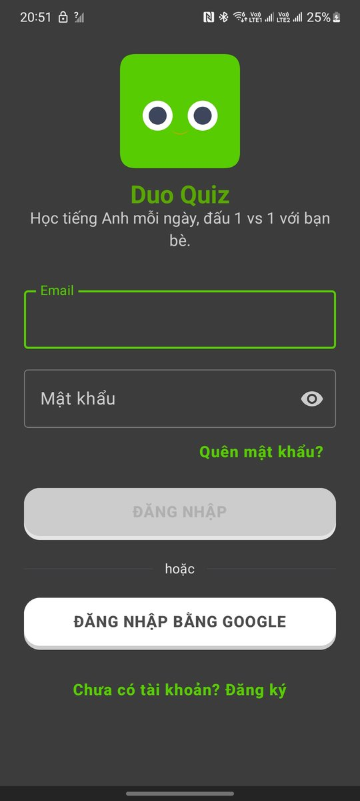 | 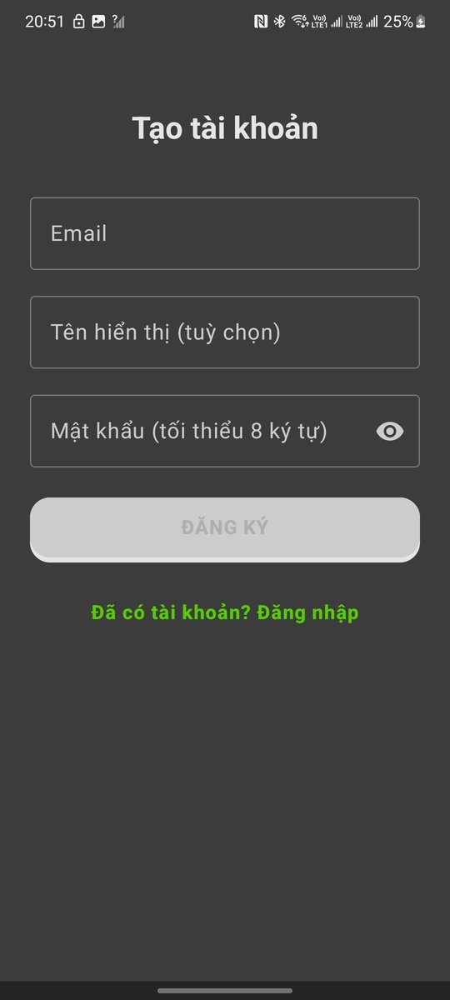 | 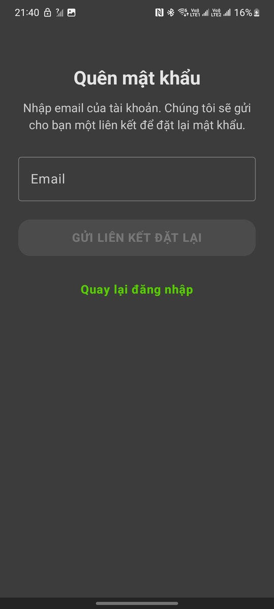 |

### Học và đánh quái

| Lộ trình học | Đánh quái | Kết quả trận | Nhiệm vụ ngày |
| :---: | :---: | :---: | :---: |
| 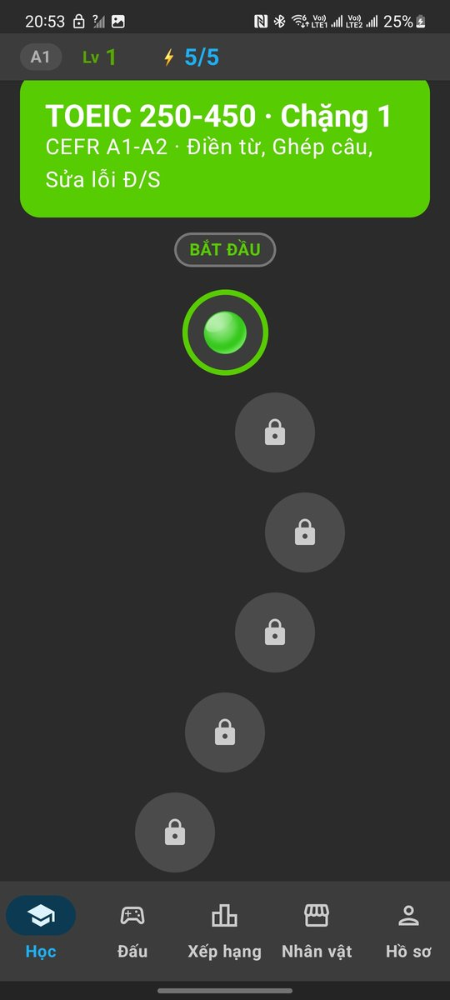 | 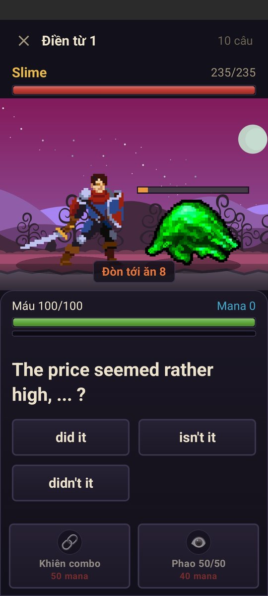 | 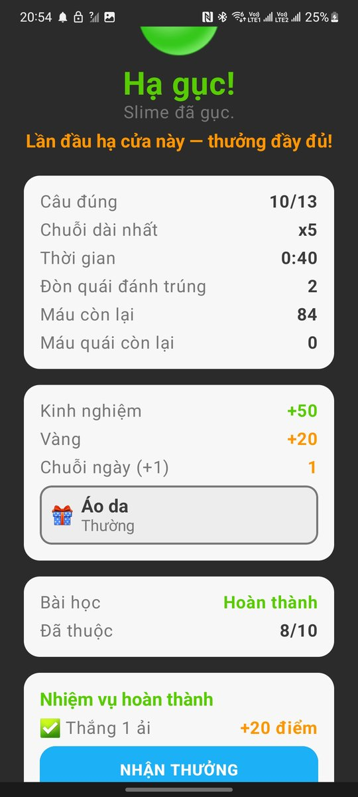 | 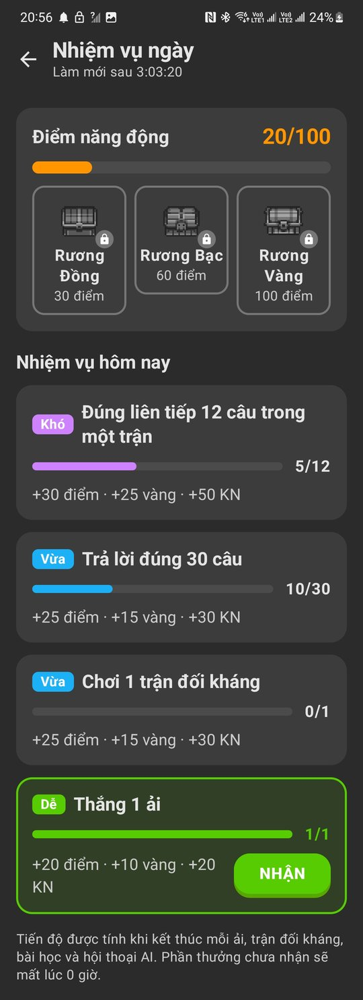 |

### Đấu 1v1

| Sảnh đấu | Trong trận | Lịch sử đấu | Bảng xếp hạng |
| :---: | :---: | :---: | :---: |
| 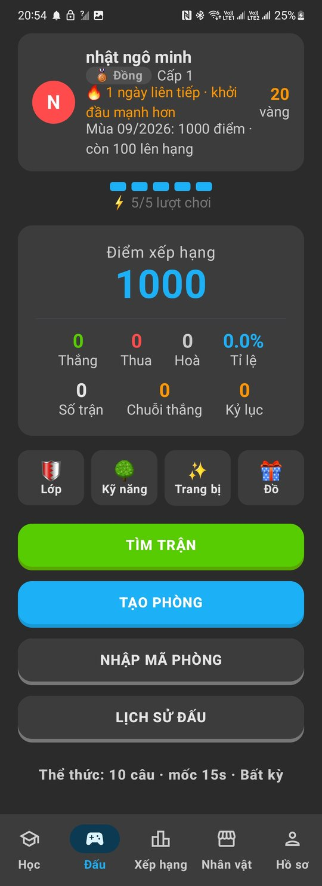 | 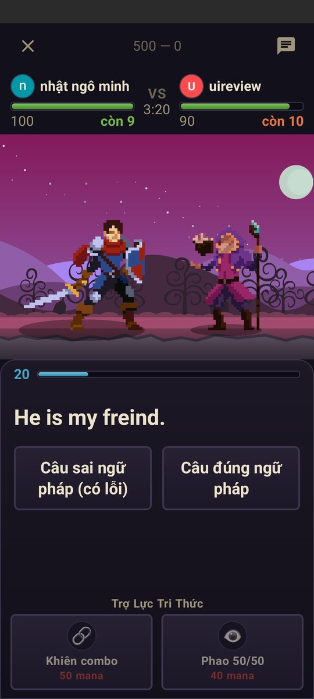 | 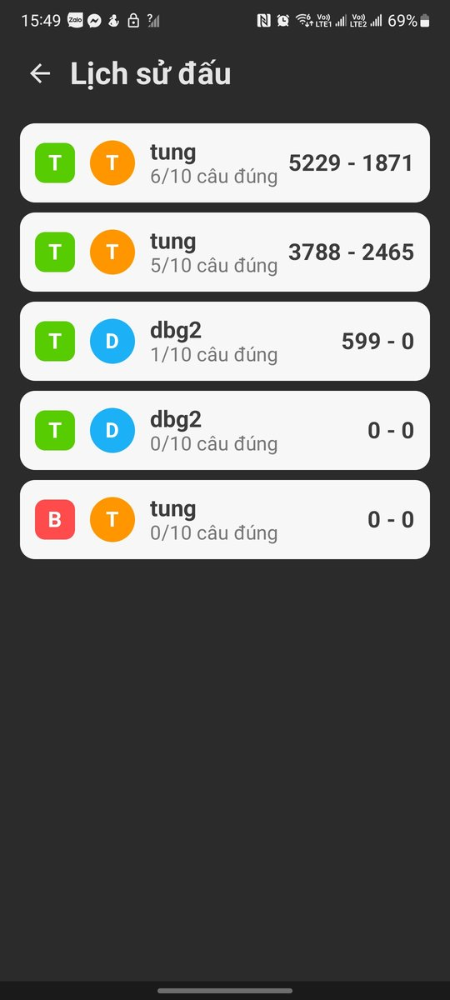 | 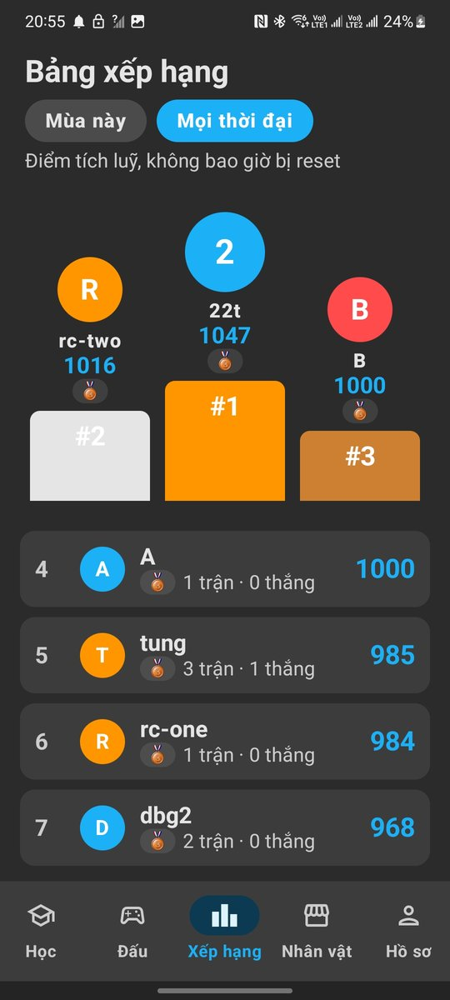 |

### Nhân vật, hồ sơ và hội thoại AI

| Hồ sơ | Tủ đồ | Cửa hàng | Luyện hội thoại AI |
| :---: | :---: | :---: | :---: |
| 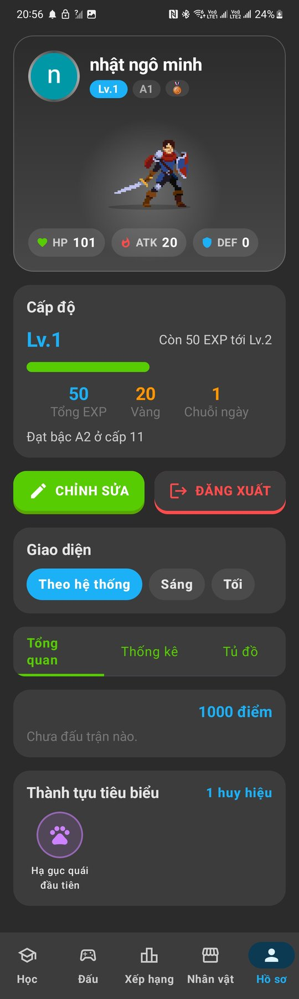 | 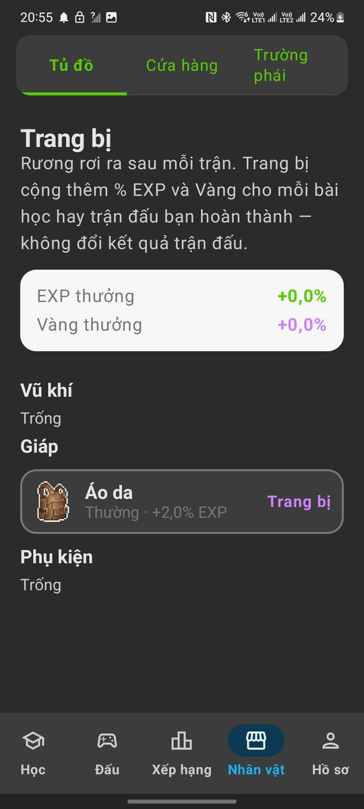 | 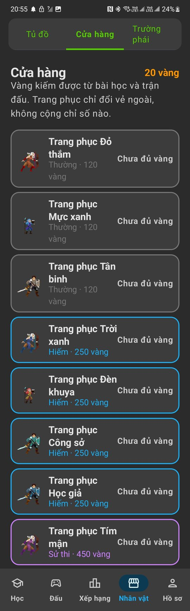 | 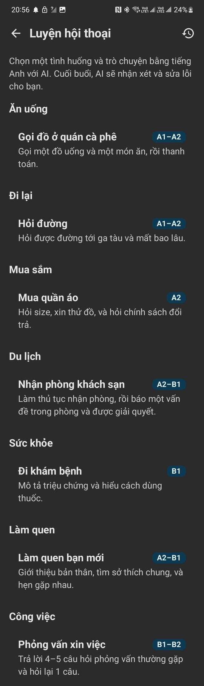 |

### Bài thi sát hạch

| Tới mốc CEFR | Câu hỏi | Câu chọn hình | Kết quả |
| :---: | :---: | :---: | :---: |
| 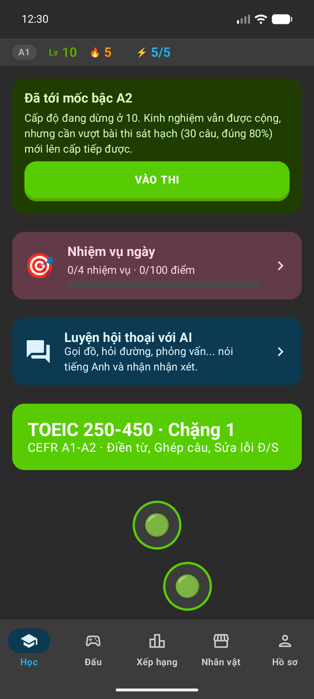 | 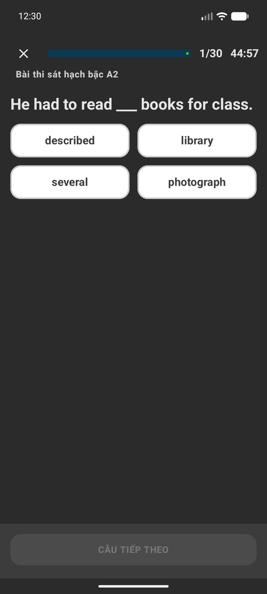 | 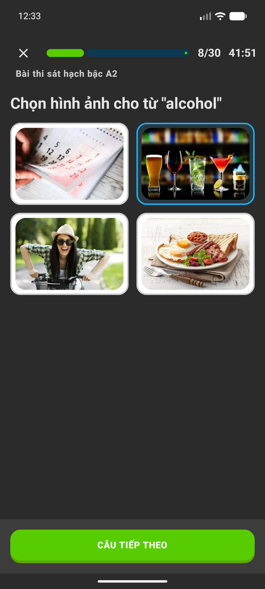 | 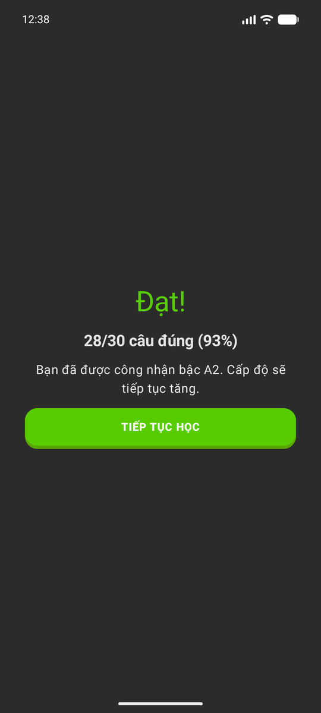 |

### Widget và thông báo

| Widget chuỗi ngày học | Thông báo đẩy |
| :---: | :---: |
| 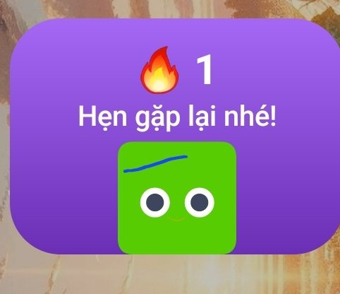 | 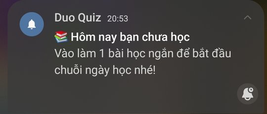 |

### Kiến trúc

App ↔ máy chủ ↔ dịch vụ ngoài:

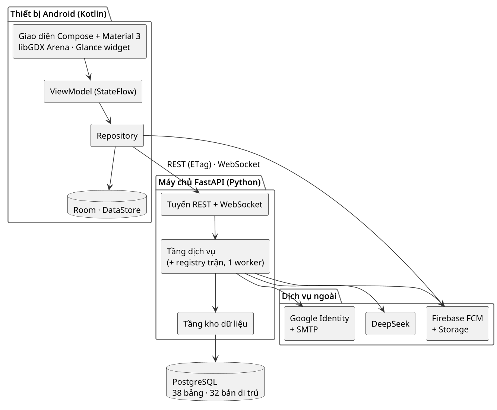

## Yêu cầu (Prerequisites)

- Android Studio bản mới (hỗ trợ Android Gradle Plugin 9.1)
- JDK 17 trở lên (dùng JDK đi kèm Android Studio là đủ)
- Android SDK Platform 36.1 (compileSdk 36, minor 1)
- Thiết bị hoặc máy ảo **Android 13 (API 33)** trở lên
- Máy chủ [quiz-game-backend](https://github.com/thanhtungct7/quiz-game-backend) đang chạy
- Tuỳ chọn: file `google-services.json` của Firebase để bật thông báo đẩy

## Cài đặt (Installation)

```bash
git clone https://github.com/thanhtungct7/quiz-game-front.git
cd quiz-game-front
```

1. Mở thư mục bằng Android Studio, chờ Gradle sync (Gradle Wrapper 9.3.1 tự tải).
2. Sửa địa chỉ máy chủ `API_BASE_URL` trong `app/build.gradle.kts` (xem [Cấu hình](#cấu-hình-configuration)).
3. (Tuỳ chọn) Tải `google-services.json` từ Firebase Console đặt vào `app/`.

Hoặc build bằng dòng lệnh:

```bash
./gradlew assembleDebug
# APK nằm ở app/build/outputs/apk/debug/app-debug.apk
```

## Sử dụng (Usage)

Cài và chạy bản debug trên thiết bị đang kết nối:

```bash
./gradlew installDebug
adb shell am start -n com.kma.quiz_game/.MainActivity
```

Hoặc bấm **Run ▶** trong Android Studio.

Chạy test:

```bash
./gradlew test    # unit test
```

Luồng dùng cơ bản:

1. Đăng ký hoặc đăng nhập (email hay Google).
2. Tab **Học**: chọn bài trên bản đồ, đánh quái bằng cách trả lời câu hỏi.
3. Tab **Đấu**: tìm trận 1v1 hoặc tạo phòng mời bạn.
4. Tab **Xếp hạng**, **Nhân vật**, **Hồ sơ**: xem thứ hạng, nâng kỹ năng, thay trang bị.

Muốn thử nhanh toàn bộ tính năng, tạo tài khoản demo đã mở khoá bên backend:
`python -m scripts.create_demo_account`.

## Cấu hình (Configuration)

Cấu hình nằm trong `buildConfigField` của `app/build.gradle.kts`:

| Trường | Ý nghĩa |
| --- | --- |
| `API_BASE_URL` | Địa chỉ API, kết thúc bằng `/api/v1/`. Mặc định là một tunnel ngrok HTTPS |
| `MEDIA_BASE_URL` | Endpoint tải file của Firebase Storage, nơi chứa ảnh/âm thanh từ vựng |
| `GOOGLE_WEB_CLIENT_ID` | OAuth client loại *Web*, phải trùng `GOOGLE_WEB_CLIENT_ID` bên backend |

Trỏ app về máy chủ của bạn:

- **Máy ảo Android**: `http://10.0.2.2:8000/api/v1/`
- **Điện thoại cùng Wi-Fi**: `http://<IP-LAN>:8000/api/v1/`
- **Qua Internet**: URL HTTPS của ngrok (hoặc tên miền thật)

Dùng HTTP (không mã hoá) thì phải khai báo địa chỉ đó trong
`app/src/main/res/xml/network_security_config.xml`. Dù dùng cách nào, host đó cũng phải có
trong `ALLOWED_HOSTS` của file `.env` bên backend, nếu không máy chủ trả `400 Invalid host header`.

Các file không commit: `local.properties` (đường dẫn SDK) và `app/google-services.json`
(cấu hình Firebase riêng từng người). Thiếu `google-services.json` app vẫn build và chạy,
chỉ tắt thông báo đẩy.

## Cấu trúc thư mục (Project Structure)

Ứng dụng theo mô hình **MVVM**: Compose Screen → ViewModel (StateFlow) → Repository →
Retrofit / WebSocket / Room / DataStore.

```
duo-game-app/
├── app/
│   ├── build.gradle.kts          # Cấu hình build, API_BASE_URL, native libGDX
│   └── src/main/
│       ├── AndroidManifest.xml
│       ├── assets/               # Ảnh quái, nhân vật, vật phẩm, rương, từ vựng
│       ├── res/                  # Tài nguyên Android, cấu hình widget, network security
│       └── java/com/kma/quiz_game/
│           ├── MainActivity.kt       # Activity duy nhất, xử lý deep link
│           ├── DuoGameApplication.kt # Khởi tạo phụ thuộc dùng chung
│           ├── data/
│           │   ├── remote/       # Retrofit API, DTO, WebSocket đấu 1v1 và PvE, token
│           │   ├── local/        # Room database, DataStore cài đặt
│           │   ├── repository/   # Auth, Learn, Duo, Battle, Game, Profile, Quest, Conversation
│           │   ├── push/         # Firebase Messaging, kênh thông báo
│           │   ├── speech/       # Nhận dạng giọng nói và đọc văn bản (hội thoại AI)
│           │   └── widget/       # Đồng bộ dữ liệu streak cho widget
│           └── ui/
│               ├── navigation/   # NavHost gốc, luồng đăng nhập, luồng chính
│               ├── screens/      # auth, learn, battle, duo, game, leaderboard,
│               │                 #   profile, quests, benchmark, conversation
│               ├── components/   # Thành phần Compose dùng lại
│               ├── game/         # Đấu trường libGDX nhúng trong Compose
│               ├── widget/       # Widget streak (Glance)
│               └── theme/        # Màu, chữ, giao diện sáng/tối
├── product/core/                 # Module thư viện (khung dựng sẵn, chưa có mã)
├── tools/battle-art/             # Script Python dựng sprite nhân vật và quái
├── docs/                         # Ảnh chụp màn hình, sơ đồ kiến trúc
├── gradle/libs.versions.toml     # Danh mục phiên bản thư viện
├── ASSETS.md                     # Nguồn và giấy phép tài nguyên đồ hoạ
└── settings.gradle.kts
```
